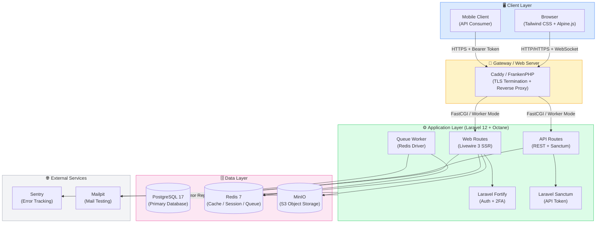
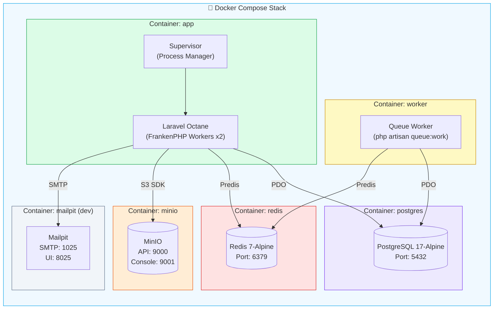
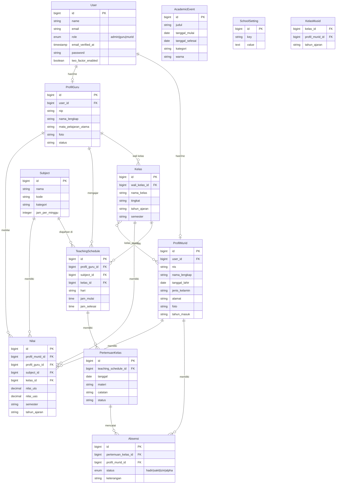
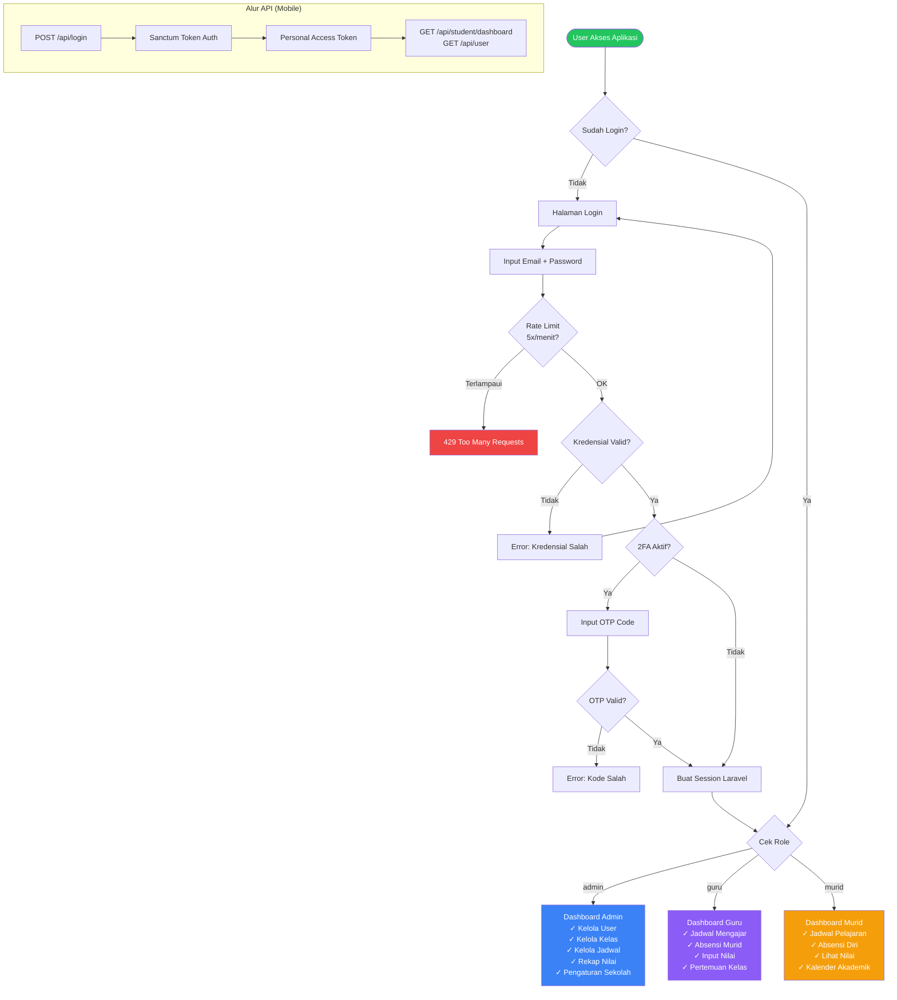
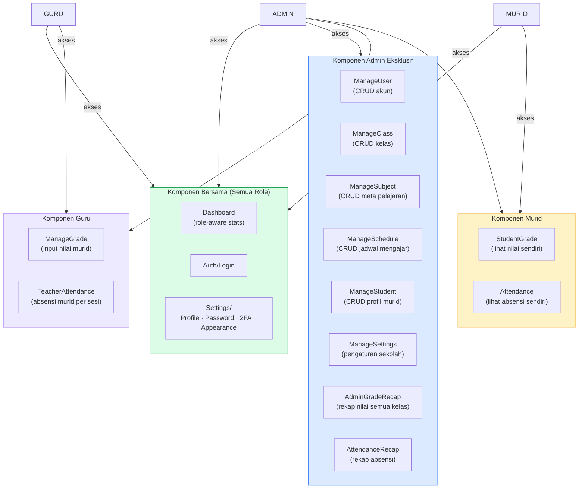
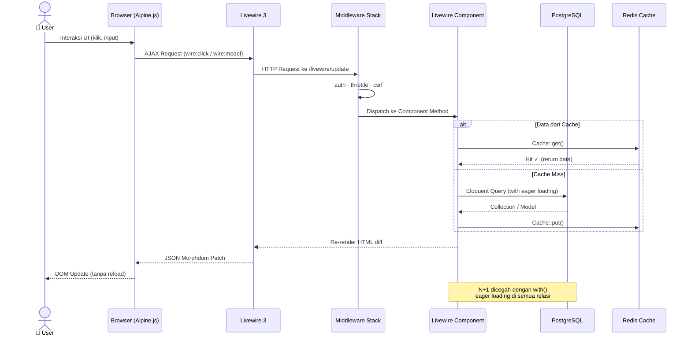
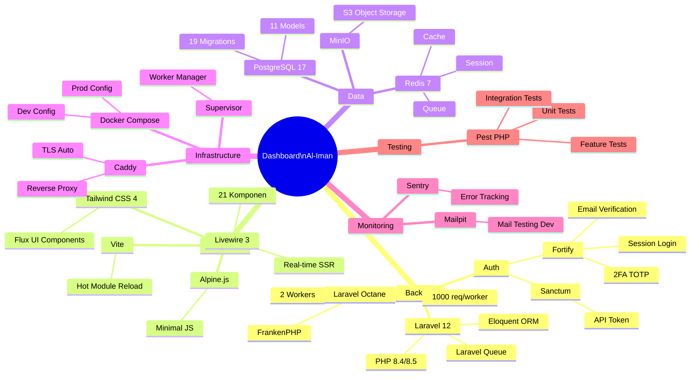

# Arsitektur Dashboard Al-Iman

> Visualisasi arsitektur sistem manajemen sekolah berbasis Laravel 12 + Livewire 3

---

## 1. Arsitektur Sistem Keseluruhan (High-Level Overview)

---

## 2. Arsitektur Docker & Infrastruktur

---

## 3. Entity Relationship Diagram (ERD)

---

## 4. Alur Autentikasi & Otorisasi

---

## 5. Komponen Livewire & Hak Akses (Role-Based)

---

## 6. Alur Request Web (Livewire Full-Stack)

---

## 7. Stack Teknologi Summary

